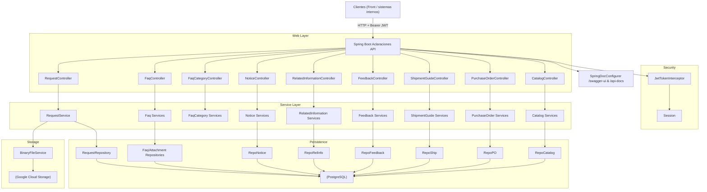

# 00 — Overview del servicio Aclaraciones API

## Propósito y alcance

- Servicio backend REST para gestionar:
  - Requests (Aclaraciones) y su ciclo de vida.
  - Comentarios y adjuntos asociados a cada Request.
  - Preguntas frecuentes (FAQs) y sus categorías.
  - Notices e información relacionada.
  - Feedback (preguntas, respuestas y publicaciones).
  - Flujos de logística: Shipment Guides y Purchase Orders.
- Alcance principal:
  - Atención a proveedores/usuarios internos respecto a problemas de órdenes, entregas y otros incidentes.
  - Exposición de catálogos de negocio reutilizables por el front (países, unidades de negocio, módulos, motivos, etc.).

## Casos de uso y consumidores

### Casos de uso principales

- Requests
  - Crear una aclaración (`POST /requests`).
  - Consultar aclaraciones del usuario (`GET /requests`).
  - Consultar una aclaración específica (`GET /requests/{requestId}`).
  - Configurar/editar una aclaración (`POST /requests/{requestId}/configure`).
  - Eliminar una aclaración (`DELETE /requests/{requestId}`).
  - Gestión de comentarios y adjuntos de una aclaración.

- FAQs y categorías
  - Buscar FAQs públicas/activas (`GET /faqs`).
  - CRUD de FAQs y categorías, con publicación/despublicación y carga masiva via CSV.

- Notices e información relacionada
  - Publicar comunicaciones/información relacionada visible en el front (`/notices`, `/related-information`).

- Feedback
  - Registrar y administrar preguntas de feedback, con respuestas asociadas.

- Shipment Guides / Purchase Orders
  - Alta, consulta y actualización de guías de embarque.
  - Consulta y actualización de órdenes de compra y recepciones.

### Consumidores

- Frontend web interno (portal de Aclaraciones / Help Center).
- Aplicaciones internas de logística y proveedores.
- Sistemas de backoffice (atención a clientes/proveedores).
- Gateway/API Management que expone `gateway/api.yml` hacia consumidores externos.

## Stack tecnológico

- Lenguaje: Java 17  
  - `maven.compiler.source=17`, `maven.compiler.target=17` en [`pom.xml`](../pom.xml).
- Framework:
  - Spring Boot 3.4.2 (`spring-boot-starter-parent`).
  - Spring Web (REST controllers).
  - Spring Data JPA (acceso a datos).
- Build:
  - Maven, wrapper `mvnw` incluido.
- Documentación de API:
  - SpringDoc OpenAPI (`springdoc-openapi-starter-webmvc-ui:2.8.5`).
  - Configuración programática en [`SpringDocConfigurer`](../src/main/java/com/sodimac/aclaraciones/api/config/SpringDocConfigurer.java).
- Seguridad:
  - Validación JWT implementada mediante interceptor custom [`JwtTokenInterceptor`](../src/main/java/com/sodimac/aclaraciones/api/security/JwtTokenInterceptor.java).
  - Security interceptor registrado en [`SecurityInterceptor`](../src/main/java/com/sodimac/aclaraciones/api/config/SecurityInterceptor.java).
- Persistencia:
  - JPA (`spring-boot-starter-data-jpa` + `jakarta.persistence-api`).
  - PostgreSQL como base de datos (driver runtime).
- Almacenamiento binario:
  - Google Cloud Storage (`google-cloud-storage:2.34.0`), implementación [`GcsBinaryFileServiceImpl`](../src/main/java/com/sodimac/aclaraciones/api/service/impl/GcsBinaryFileServiceImpl.java).
- Testing:
  - `spring-boot-starter-test`.
  - Derby embebido para pruebas (scope `test`).
- Observabilidad:
  - Logging configurado vía `application.properties`.
  - Actuator expone endpoint `health` (sin más endpoints por defecto).

## Integraciones externas

- Base de datos:
  - PostgreSQL vía JDBC (`spring.datasource.url/username/password`).
- Identity Provider (Keycloak u otro compatible con JWT):
  - Cabecera configurable (`aclaraciones.jwt.header`).
  - Grupos mapeados vía propiedades `aclaraciones.jwt.role.operador` y `aclaraciones.jwt.role.proveedor`.
  - Clave pública del realm: `aclaraciones.jwt.signing.publicKey=${KEYCLOAK_REALM_CERT}` (actualmente no utilizada para verificación en el código).
- Google Cloud Storage:
  - Bucket fijo en código para dev: `fs-sod-mx-mrch-aclaraciones-dev`.
  - Prefijo fijo: `bk-aclaraciones-dev/aclaraciones/`.
  - Client auto-configurado vía `StorageOptions.getDefaultInstance().getService()`.

## Ambientes, dominios y base URLs

- Configuración de servidor:
  - `server.port=8082`
  - `server.servlet.contextPath=/`
- `gateway/api.yml` define:
  - `servers[0].url=http://localhost:8082` para desarrollo local.
- Ambientes productivos (`dev/qa/uat/prod`):
  - PENDIENTE: dominios concretos y base URLs reales (proporcionados por DevOps / plataforma).
  - Fuente recomendada: manifiestos de Kubernetes/kustomize y configuración del gateway que consume `gateway/api.yml`.

# 02 — Arquitectura técnica

## Vista de alto nivel

- Aplicación Spring Boot monolítica empaquetada como JAR (`aclaraciones-api-1.0-SNAPSHOT.jar`).
- Expone endpoints REST documentados en:
  - Controladores bajo `com.sodimac.aclaraciones.api.controller.*`
  - Especificación OpenAPI para gateway en `gateway/api.yml`.
- Capa de acceso a datos con Spring Data JPA hacia PostgreSQL.
- Almacenamiento de binarios en Google Cloud Storage cuando `aclaraciones.storage.type=gcs`.

## Componentes principales

- Entrypoint:
  - [`AclaracionesApi`](../src/main/java/com/sodimac/aclaraciones/api/AclaracionesApi.java) — clase `@SpringBootApplication`.

- Capa web (controllers):
  - `RequestController` — `/requests` + subrutas (comentarios, adjuntos, configure, etc.).
  - `AttachmentController` — `/requests/{requestId}/attachments`.
  - `CommentController` — `/requests/{requestId}/comments`.
  - `CatalogController` — `/catalogs/{type}`.
  - `FaqController` — `/faqs`.
  - `FaqCategoryController` — `/faq-categories`.
  - `NoticeController` — `/notices`.
  - `RelatedInformationController` — `/related-information`.
  - `FeedbackController` — `/feedback`.
  - `ShipmentGuideController` — `/shipment-guides`.
  - `PurchaseOrderController` — `/purchase-orders`.

- Capa de servicios:
  - Servicios de negocio segmentados por dominio:
    - `RequestService` (casos/aclaraciones).
    - Servicios de FAQ (`FaqCommandService`, `FaqQueryService`, etc.).
    - Servicios de categorías, feedback, notices, related information.
    - Servicios de logística (`ShipmentGuideService`, `ShipmentGuideQueryService`, `ShipmentGuideUpdateService`, `PurchaseOrderService`).
  - Reglas de negocio y validaciones se concentran aquí.

- Persistencia:
  - Repositorios Spring Data en `com.sodimac.aclaraciones.api.repository.*`
  - Entidades JPA en `com.sodimac.aclaraciones.api.model.entity.*`.

- Seguridad:
  - Interceptor `JwtTokenInterceptor` filtrando todas las rutas excepto documentación/errores.
  - `SecurityInterceptor` registra el interceptor como `WebMvcConfigurer`.

- Storage:
  - Interfaz `BinaryFileService`.
  - Implementación `GcsBinaryFileServiceImpl` anotada con `@ConditionalOnProperty(name = "aclaraciones.storage.type", havingValue = "gcs")`.

## Diagrama de componentes (Mermaid)



## Observabilidad

- Logging:
  - Nivel por defecto:
    - `logging.level.root=INFO`
    - `logging.level.com.sodimac=DEBUG`
  - Output a archivo: `logging.file.name=./app.log` (rotación con tamaño y history).
- Actuator:
  - `management.endpoints.web.exposure.include=health` — expone `/actuator/health`.
  - Otros endpoints de Actuator están deshabilitados por defecto.

## Interacción con el gateway

- Archivo `gateway/api.yml`:
  - Describe la API pública consumida por el API Gateway.
  - Incluye `security: - bearerAuth: []` a nivel global.
  - Define el esquema `bearerAuth` compatible con SpringDoc.
- `docs/04-openapi.yaml`:
  - Resumen interno; la fuente de verdad para exposición externa es `gateway/api.yml` o `/api-docs` del servicio.

# 03 — Catálogo narrativo de endpoints

> Este catálogo resume el comportamiento de cada endpoint.  
> Para definición formal ver `docs/03-endpoints.csv` y `gateway/api.yml`.

---

## Requests (`/requests`)

### POST /requests

- Propósito: crear una nueva Request (Aclaración).
- Controlador: `RequestController.post`.
- Auth: Bearer JWT (interceptor `JwtTokenInterceptor` + `@RequireRole`).
- Request body: `RequestDto` con datos de la aclaración (orden, motivo, detalle, datos del solicitante, etc.).
- Response:
  - 200 (o equivalente 201) con id numérico de la Request creada.
- Errores:
  - 401: sin token o token inválido.
  - 403: token sin roles/grupos adecuados.
  - 500: errores internos / base de datos.

### GET /requests

- Propósito: listar Requests de la sesión actual con filtros.
- Parámetros query:
  - `criteria`: texto (id orden, proveedor o id de request).
  - `dateFrom` / `dateTo`: filtros por fecha de creación.
  - `reason`: id de motivo.
  - `status` (en gateway) / `clazz` (en controller) para estado/columna Kanban.
- Response: lista de `RequestDto`.
- Observaciones:
  - Fechas convertidas en `RequestController` con `SimpleDateFormat`.
  - Usa `Session` del interceptor para acotar consultas al usuario.

### GET /requests/{requestId}

- Propósito: obtener detalle de una Request específica.
- Path params: `requestId` (int).
- Response: `RequestDto`.
- Errores esperados: 401, 403, 404, 500.

### POST /requests/{requestId}/configure

- Propósito: actualizar campos/configuración de una Request.
- Request body: `RequestDto` con los datos a configurar.
- Response: `void` (HTTP 200 sin body).
- Lógica: delega en `RequestService.configure`.

### DELETE /requests/{requestId}

- Propósito: eliminar lógicamente una Request.
- Response: `RequestDto` resultante (estado final).
- Errores: 401, 403, 404, 500.

### Comentarios y adjuntos

- GET/POST `/requests/{requestId}/comments`:
  - Obtener/crear comentarios (`CommentDto`) asociados a una Request.
- GET/POST `/requests/{requestId}/attachments`:
  - Listar y crear adjuntos (`AttachmentDto` sin/ con contenido).
- GET `/requests/{requestId}/attachments/{attachmentId}`:
  - Obtener adjunto con contenido Base64 (`content`).

---

## Catálogos (`/catalogs`)

### GET /catalogs/{type}

- Propósito: obtener valores de catálogo (unidades de negocio, países, módulos, motivos, etc.).
- Path param: `type` (int).
- Query param: `parentId` opcional.
- Response: lista de `CatalogDto`.
- Auth: Bearer JWT (gateway exige header `Authorization`).

---

## FAQs (`/faqs`) y categorías (`/faq-categories`)

- GET /faqs:
  - Búsqueda de FAQs activas por texto, categoría, popularidad.
  - Response: `FaqView[]`.
- POST /faqs:
  - Crea FAQ con posible adjunto (multipart).
  - Request: `CreateFaqRequest`.
- GET/PUT/DELETE /faqs/{id}:
  - Detalle, actualización y borrado de FAQ (`FaqDetailResponse`, `FaqResponse`).
- Publicación:
  - POST `/faqs/{id}/publish`, `/faqs/{id}/unpublish`, PATCH `/faqs/{id}/publication`.

- Categorías:
  - GET /faq-categories: lista de categorías (`FaqCategoryDto[]`).
  - POST/PUT/DELETE /faq-categories/{id}.
  - Publicación y bulk upload análogos a FAQs.

---

## Notices y Related Information

- `/notices`:
  - GET: lista de Notices (`NoticeDto[]`).
  - POST: crea Notice (`NoticeDto` → id).
  - GET/PUT/DELETE `/notices/{noticeId}`.
  - POST `/notices/{noticeId}/publish` con query `publish` (boolean).

- `/related-information`:
  - GET: lista de `RelatedInformationDto`.
  - POST: crea entrada.
  - GET/PUT/DELETE `/related-information/{id}`.
  - POST `/related-information/{id}/publish` y `/unpublish`.

---

## Feedback (`/feedback`)

- GET /feedback:
  - Lista preguntas de feedback (`FeedbackDto[]`).
- POST /feedback:
  - Crea nueva pregunta de feedback (`FeedbackDto`).
- GET/PUT/DELETE `/feedback/{id}`:
  - Detalle, actualización y borrado.
- Publicación:
  - POST `/feedback/{id}/publish`, `/feedback/{id}/unpublish`.

---

## Shipment Guides (`/shipment-guides`)

Basado en `ShipmentGuideController` y `gateway/api.yml`.

- POST /shipment-guides:
  - Propósito: alta de guía de embarque.
  - Request: `CreateShipmentGuideRequest` validado con `@Validated`.
  - Response:
    - 201 + Location `/shipment-guides/{id}` y body `{id, message}`.
  - Errores:
    - 400 con `{code, message}` para reglas de negocio (`IllegalStateException`).
    - 500 con `{code="ERR_DATABASE", message=...}` para errores de BD.

- GET /shipment-guides:
  - Consulta con filtros (`ShipmentGuideFilter`):
    - supplierNumber, guideNumber, purchaseOrder, status, from/toShipDate, from/toRegDate.
  - Response: `ShipmentGuideView[]`.

- PATCH /shipment-guides/{id}:
  - Actualiza estado/datos de la guía.
  - Request: `UpdateShipmentGuideRequest`, header obligatorio `X-User`.
  - Errores:
    - 404 (NoSuchElementException).
    - 400 (IllegalArgumentException).
    - 500 (DataAccessException).

---

## Purchase Orders (`/purchase-orders`)

- GET /purchase-orders:
  - Consulta ordenes y recepciones (`PurchaseOrderView[]`).
- POST /purchase-orders:
  - Crea orden de compra (`CreatePurchaseOrderRequest`).
- PATCH /purchase-orders/{ordenCompra}:
  - Actualiza estado de OC y recepciones (`UpdatePurchaseOrderRequest`).

---

## Referencias cruzadas

- Detalles tabulares: `docs/03-endpoints.csv`.
- Definiciones formales de request/response: `gateway/api.yml` (components.schemas.*).
- Ejemplos de request/response: ver secciones `examples` de `gateway/api.yml` donde existan; en su defecto, derivar de los DTOs Java.

# Runbook — Aclaraciones API

## Requisitos mínimos
- JDK 17 (ver [`pom.xml`](../pom.xml)).
- Maven (usar wrapper `./mvnw`).
- Base de datos PostgreSQL accesible.
- Credenciales para Google Cloud Storage (si `aclaraciones.storage.type=gcs`).

## Configuración de aplicación

### `src/main/resources/application.properties` (extraído del repo)
- Servidor:
  - `server.port=8082`
  - `server.servlet.contextPath=/`
- CORS:
  - `cors.allowed-origins=*`
  - `cors-allowed-mapping=/**`
- JPA / DB:
  - `spring.jpa.hibernate.ddl-auto=update`
  - `spring.datasource.url=${DATASOURCE_URL}`
  - `spring.datasource.username=${DATASOURCE_USERNAME}`
  - `spring.datasource.password=${DATASOURCE_PASSWORD}`
  - `spring.datasource.driver-class-name=org.postgresql.Driver`
  - `spring.jpa.database-platform=org.hibernate.dialect.PostgreSQLDialect`
- Actuator:
  - `management.endpoints.web.exposure.include=health`
- Logging:
  - `logging.level.root=INFO`
  - `logging.level.com.sodimac=DEBUG`
  - `logging.file.name=./app.log`
  - `logging.file.max-size=2MB`
  - `logging.file.max-history=5`
- Seguridad JWT:
  - `aclaraciones.jwt.signing.publicKey=${KEYCLOAK_REALM_CERT}`
  - `aclaraciones.jwt.role.operador=${KEYCLOAK_GROUP_OPERADOR}`
  - `aclaraciones.jwt.role.proveedor=${KEYCLOAK_GROUP_PROVEEDOR}`
  - `aclaraciones.jwt.header=${CUSTOM_AUTH_HEADER:Authorization}`
  - `aclaraciones.jwt.enabled=${ACLARACIONES_JWT_ENABLED:false}`
- Swagger / OpenAPI:
  - `springdoc.swagger-ui.path=/swagger-ui`
  - `springdoc.api-docs.path=/api-docs`
- Storage / reglas:
  - `aclaraciones.storage.type=gcs`
  - `aclaraciones.requests.maximumTimeThreshold=864000000`
- Multipart:
  - `spring.servlet.multipart.enabled=true`
  - `spring.servlet.multipart.max-file-size=10MB`
  - `spring.servlet.multipart.max-request-size=20MB`
  - `server.tomcat.max-swallow-size=20MB`

### Variables de entorno sugeridas
- `DATASOURCE_URL`, `DATASOURCE_USERNAME`, `DATASOURCE_PASSWORD`.
- `KEYCLOAK_REALM_CERT` (si se valida firma con clave pública).
- `KEYCLOAK_GROUP_OPERADOR`, `KEYCLOAK_GROUP_PROVEEDOR`.
- `CUSTOM_AUTH_HEADER` (si se desea header distinto de `Authorization`).
- `ACLARACIONES_JWT_ENABLED` (`true`/`false`).
- `GOOGLE_APPLICATION_CREDENTIALS` y `GCS_BUCKET` (para GCS).

## Arranque local

1. Exportar variables (ejemplo PowerShell):
   ```powershell
   $env:DATASOURCE_URL="jdbc:postgresql://localhost:5432/aclaraciones"
   $env:DATASOURCE_USERNAME="user"
   $env:DATASOURCE_PASSWORD="pass"
   $env:GOOGLE_APPLICATION_CREDENTIALS="C:\ruta\a\sa.json"
   ```
2. Ejecutar:
   ```bash
   ./mvnw spring-boot:run
   ```
3. Verificar:
   - UI Swagger: `http://localhost:8082/swagger-ui`
   - OpenAPI JSON: `http://localhost:8082/api-docs`
   - Health: `http://localhost:8082/actuator/health` (expuesto vía `management.endpoints.web.exposure.include=health`)

## Validación JWT (estado actual y recomendado)

### Implementación actual (código)
- Clase: [`JwtTokenInterceptor`](../src/main/java/com/sodimac/aclaraciones/api/security/JwtTokenInterceptor.java).
- Comportamiento:
  - Ignora:
    - `/swagger-ui`, `/swagger-ui/**`, `/swagger-ui.html`, `/api-docs`, `/api-docs.yaml`, `/api-docs.json`, `/error`, `/favicon.ico`.
  - Para el resto:
    - Requiere header `${aclaraciones.jwt.header}` con prefijo `Bearer `.
    - Decodifica el token con `JWT.decode(token)` (sin verificar firma).
    - Lee claims `"name"`, `"email"` y `"groups"`.
    - Si el usuario no tiene grupo operador ni proveedor, añade proveedor por defecto.
    - Crea `Session` y la guarda como attribute `session` en el request.
- Riesgo:
  - Sin validación de firma / issuer / exp / aud, tokens manipulados podrían ser aceptados.

### Pasos recomendados (para que los aplique el desarrollador)
1. **Opción recomendada** — usar Resource Server:
   - Añadir dependencia en `pom.xml`:
     ```xml
     <dependency>
         <groupId>org.springframework.boot</groupId>
         <artifactId>spring-boot-starter-oauth2-resource-server</artifactId>
     </dependency>
     ```
   - Añadir propiedades:
     ```properties
     spring.security.oauth2.resourceserver.jwt.jwk-set-uri=${KEYCLOAK_JWKS_URI}
     # o alternativamente:
     # spring.security.oauth2.resourceserver.jwt.issuer-uri=${KEYCLOAK_ISSUER_URI}
     ```
   - Crear `SecurityConfig` que:
     - Permita `swagger-ui` y `api-docs` sin auth.
     - Requiera autenticación JWT para el resto.
     - Opcionalmente, rellene `request.setAttribute("session", ...)` a partir del `Jwt` del contexto.

2. **Opción mínima** — mantener interceptor pero validar firma:
   - Usar `JWT.require(Algorithm).withIssuer(...).build().verify(token)` con la clave pública derivada de `KEYCLOAK_REALM_CERT` o JWKS.
   - Rechazar tokens con firma inválida o expirados (responder 401).

## Troubleshooting

- **401 Unauthorized**
  - Header de autorización ausente o sin prefijo `Bearer`.
  - Token no decodificable (`invalid_token` en body).
- **403 Forbidden**
  - Token válido pero grupos insuficientes en lógica de negocio / anotaciones `@RequireRole`.
- **Errores de DB**
  - Revisar credenciales y URL de `spring.datasource.*`.
  - Revisar logs (archivo `./app.log`).
- **Errores de GCS**
  - Revisar `GOOGLE_APPLICATION_CREDENTIALS` y permisos del service account.
  - Ver logs de `GcsBinaryFileServiceImpl`.

## Comandos útiles

- Build y tests:
  ```bash
  ./mvnw clean package
  ./mvnw test
  ```
- Ejecutar JAR:
  ```bash
  java -jar target/aclaraciones-api-1.0-SNAPSHOT.jar
  ```
- Prueba rápida de endpoint protegido:
  ```bash
  curl -v -H "Authorization: Bearer <token>" http://localhost:8082/requests
  ```

# 06 — Estructura del proyecto

## Estructura de carpetas (alto nivel)

- `src/main/java/com/sodimac/aclaraciones/api`
  - `AclaracionesApi` — clase de arranque `@SpringBootApplication`.
  - `controller/` — capa de presentación (REST controllers).
  - `service/` — capa de servicios de dominio (command/query, shipment, feedback, etc.).
  - `repository/` — interfaces Spring Data JPA.
  - `model/dto/` — DTOs expuestos en la API (RequestDto, AttachmentDto, NoticeDto, RelatedInformationDto, FeedbackDto, etc.).
  - `model/entity/` — entidades JPA.
  - `config/` — configuración de infraestructura (SpringDocConfigurer, SecurityInterceptor).
  - `security/` — interceptor JWT (`JwtTokenInterceptor`), modelo de `Session`, anotaciones de seguridad (`RequireRole`).
  - `exception/` — clases de error (`GenericException`, `ExceptionWrapper`), posible `@ControllerAdvice` (si se agrega posteriormente).
- `src/main/resources`
  - `application.properties` — configuración de servidor, DB, logging, JWT, storage, multipart.
- `gateway/api.yml`
  - OpenAPI 3.1 usado por el API Gateway como fuente de verdad de la API expuesta.

## Responsabilidades por módulo

### Controllers

- Encapsulan lógica HTTP:
  - Mapping de rutas, path/query params, headers.
  - Conversión JSON↔DTO.
  - Uso de `@Validated` para ciertos DTOs de entrada.
- No ejecutan reglas de negocio complejas; delegan en servicios.

### Services

- Implementan la lógica de negocio:
  - Validaciones de dominio y flujos de estado.
  - Orquestación entre repositorios y servicios externos (GCS).
- En logística (`shipment` y `purchase-order`):
  - Se encargan de construir respuestas de error coherentes (por ejemplo, `IllegalStateException` y `DataAccessException` se traducen a códigos específicos en `ShipmentGuideController`).

### Repositories

- Interfaces Spring Data JPA responsables de CRUD y consultas derivadas.
- No contienen lógica de negocio.

### Security

- `JwtTokenInterceptor`:
  - Encargado de validar presencia y formato de header JWT.
  - Decodifica el token (sin verificar firma) y construye `Session`.
- `SecurityInterceptor`:
  - Registra el interceptor para todas las rutas excepto documentación y recursos comunes.
- `Session`:
  - Contiene `name`, `email`, `groups` y flag `operator`.

### Config

- `SpringDocConfigurer`:
  - Declara el esquema de seguridad `bearerAuth` y aplica `SecurityRequirement` global.
- Otros `@Configuration` podrán agregarse (por ejemplo, `SecurityConfig` si se adopta Resource Server).

## Patrones aplicados

- Arquitectura en capas:
  - Controller → Service → Repository.
- DTO vs Entity:
  - Separación clara entre entidades de persistencia (`entity`) y DTOs expuestos en API (`dto`).
- Adapter:
  - `BinaryFileService` permite cambiar implementación de almacenamiento (GCS vs otra) mediante `@ConditionalOnProperty`.
- Validación:
  - Uso de `jakarta.validation` en varios DTOs (`NoticeDto`, `FaqCategoryDto`, etc.).
- Cross-cutting concern:
  - Seguridad y logging se manejan centralmente (interceptor y configuración de logging en properties).

# Configuración de seguridad — Aclaraciones API

## Tipo de seguridad

- Autenticación basada en **Bearer JWT** en cabecera HTTP.
- Validación actual implementada por un **interceptor Spring MVC**:
  - [`JwtTokenInterceptor`](../src/main/java/com/sodimac/aclaraciones/api/security/JwtTokenInterceptor.java)
  - Registrado en [`SecurityInterceptor`](../src/main/java/com/sodimac/aclaraciones/api/config/SecurityInterceptor.java)

## Configuración actual (extraída del código y `application.properties`)

### Propiedades de seguridad

Desde `src/main/resources/application.properties`:

- `aclaraciones.jwt.signing.publicKey=${KEYCLOAK_REALM_CERT}`
- `aclaraciones.jwt.role.operador=${KEYCLOAK_GROUP_OPERADOR}`
- `aclaraciones.jwt.role.proveedor=${KEYCLOAK_GROUP_PROVEEDOR}`
- `aclaraciones.jwt.header=${CUSTOM_AUTH_HEADER:Authorization}`
- `aclaraciones.jwt.enabled=${ACLARACIONES_JWT_ENABLED:false}`

Y desde el constructor del interceptor:

- `aclaraciones.jwt.contains-match` (default `false`)
- `springdoc.swagger-ui.path` (default `/swagger-ui`)
- `springdoc.api-docs.path` (default `/api-docs`)

### Flujo en `JwtTokenInterceptor`

1. **Rutas excluidas**  
   - `/error`, `/favicon.ico`
   - `/swagger-ui`, `/swagger-ui/**`, `/swagger-ui.html`
   - `/api-docs`, `/api-docs.yaml`, `/api-docs.json`
   - Cualquier ruta que matchée `springdoc.swagger-ui.path` o `springdoc.api-docs.path`.

2. **CORS preflight**  
   - Si `HttpMethod` es `OPTIONS`, se permite sin validación.

3. **Autenticación**
   - Lee header `${aclaraciones.jwt.header}` (default `Authorization`).
   - Requiere prefijo `Bearer `; en caso contrario retorna `401`.

4. **Procesamiento JWT**
   - Llama `JWT.decode(token)` (lib `com.auth0:java-jwt`).
   - No utiliza `aclaraciones.jwt.signing.publicKey` ni verifica firma.
   - Extrae claims:
     - `"name"` → `String name`
     - `"email"` → `String email`
     - `"groups"` → `List<String> groups`

5. **Roles / grupos**
   - Comprueba si `groups` contiene `aclaraciones.jwt.role.operador` o `aclaraciones.jwt.role.proveedor`:
     - Matching exacto (case-insensitive) o por `contains` si `aclaraciones.jwt.contains-match=true`.
   - Si no encuentra ninguno de los dos:
     - Añade el grupo proveedor por defecto (`roleProveedor`) a la lista.
     - Registra un warning en logs.

6. **Contexto de sesión**
   - Crea `Session`:
     ```java
     new Session(name, email, groups)
     ```
   - La inyecta en el request como atributo `"session"`.
   - Los controladores reciben `Session` vía `@RequestAttribute("session")`.

### OpenAPI / SpringDoc

- Configuración en [`SpringDocConfigurer`](../src/main/java/com/sodimac/aclaraciones/api/config/SpringDocConfigurer.java):
  - Define `securitySchemes.bearerAuth` de tipo `http` + `scheme: bearer` + `bearerFormat: JWT`.
  - Añade `SecurityRequirement` global con `bearerAuth`.

## Integración con el gateway/API Management

- `gateway/api.yml`:
  - Declara `security: - bearerAuth: []` a nivel global.
  - Define `components.securitySchemes.bearerAuth` compatible con `SpringDocConfigurer`.
- Consistencia:
  - El encabezado esperado por gateway es `Authorization: Bearer <token>`.
  - Debe alinearse con `aclaraciones.jwt.header` (por defecto `Authorization`); si se usa `CUSTOM_AUTH_HEADER` distinto, actualizar gateway y documentación.

## Riesgos identificados

- **Firma no verificada**  
  - `JWT.decode` solo decodifica el token; no valida firma, issuer, audiencia ni expiración.
  - Cualquier token con estructura JWT válida y claims esperados puede ser aceptado, incluso si ha sido modificado.

- **Asignación automática de rol proveedor**  
  - Si el token no incluye grupos esperados, se añade `PROVEEDOR` por defecto.
  - Esto abre la puerta a escalada de privilegios implícita.

- **Propiedad `aclaraciones.jwt.enabled` sin efecto en el interceptor**  
  - No se usa actualmente para habilitar/deshabilitar validación.

## Recomendaciones (para que el equipo las implemente)

1. **Adoptar Spring Security OAuth2 Resource Server**
   - Añadir dependencia en `pom.xml`:
     ```xml
     <dependency>
         <groupId>org.springframework.boot</groupId>
         <artifactId>spring-boot-starter-oauth2-resource-server</artifactId>
     </dependency>
     ```
   - Configurar uno de los siguientes:
     ```properties
     spring.security.oauth2.resourceserver.jwt.jwk-set-uri=${KEYCLOAK_JWKS_URI}
     # o:
     # spring.security.oauth2.resourceserver.jwt.issuer-uri=${KEYCLOAK_ISSUER_URI}
     ```
   - Definir un `SecurityFilterChain` que:
     - Permita `/swagger-ui/**`, `/api-docs/**`, `/error`, `/favicon.ico`.
     - Requiera autenticación JWT en el resto de rutas.
   - Añadir un filtro ligero que construya `Session` a partir de `Jwt` para mantener compatibilidad con el código existente (controladores que esperan `Session` como `@RequestAttribute`).

2. **Si se mantiene el interceptor custom**, mínimo:
   - Leer `aclaraciones.jwt.signing.publicKey` (PEM) y construir `RSAPublicKey`.
   - Usar:
     ```java
     JWT.require(Algorithm.RSA256(publicKey, null))
         .withIssuer("PENDIENTE_ISSUER")
         .build()
         .verify(token);
     ```
   - Manejar excepciones de verificación como `401` y registrar razón.

3. **Endurecer política de roles**
   - Eliminar la asignación automática de `roleProveedor`.
   - En su lugar, retornar `403` o `401` cuando los grupos no cumplen requisitos.
   - Documentar qué grupos exactos permiten cada operación (puede modelarse en anotaciones o en configuración externa).

4. **CORS**
   - Actualmente:
     - `cors.allowed-origins=*`
     - `cors-allowed-mapping=/**`
   - Recomendado para producción:
     - Restringir orígenes a dominios de front autorizados (por ejemplo, lista separada por comas).
     - Configurar CORS centralizado vía `WebMvcConfigurer` o gateway.

5. **Observabilidad de seguridad**
   - Añadir `spring-boot-starter-actuator` y exponer al menos:
     - `/actuator/health`
     - `/actuator/metrics` (si se conecta a un backend de métricas).
   - Monitorear:
     - Tasa de `401`/`403`.
     - Errores de validación de token.
     - Latencias en endpoints críticos.

## Checklist antes de despliegue

- [ ] `KEYCLOAK_JWKS_URI` o `KEYCLOAK_ISSUER_URI` definidos y probados.
- [ ] Tokens emitidos por el IdP incluyen `name`, `email` y `groups` (o mecanismo equivalente) de forma consistente.
- [ ] Política de grupos/roles revisada y aplicada sin auto-asignación de roles.
- [ ] CORS configurado con orígenes restringidos en entornos no locales.
- [ ] `aclaraciones.jwt.enabled` utilizado para controlar comportamiento en entornos de desarrollo vs. producción (si aplica).
- [ ] Logs de seguridad (`logging.level.com.sodimac`) revisados para evitar fugas de información sensible en producción.

# 08 — Gaps y TODOs

## Seguridad JWT

- Gap: `JwtTokenInterceptor` usa `JWT.decode(token)` sin validar firma, issuer, audience ni expiración.
- Acción:
  - Evaluar migración a `spring-boot-starter-oauth2-resource-server` con `jwk-set-uri` o `issuer-uri`.
  - O, en su defecto, usar `JWT.require(Algorithm).verify(token)` con `aclaraciones.jwt.signing.publicKey` o JWKS.

- Gap: `aclaraciones.jwt.enabled` no se usa en el interceptor.
- Acción:
  - Usar esta propiedad para deshabilitar el interceptor en entornos dev / pruebas, o eliminarla si no se usará.

- Gap: Auto-asignación de grupo proveedor cuando no se encuentra grupo válido.
- Acción:
  - Reemplazar por respuesta 403 y documentar roles requeridos.

## CORS

- Gap: `cors.allowed-origins=*` en `application.properties` apto solo para dev.
- Acción:
  - Configurar lista concreta de orígenes en prod.
  - Coordinar con gateway para política CORS consistente.

## Observabilidad

- Gap: No se usa `spring-boot-starter-actuator` para métricas/health extendido.
- Acción:
  - Añadir Actuator y, opcionalmente, Micrometer y backend de métricas.
  - Definir permisos de acceso a `/actuator/**`.

## Configuración de GCS

- Gap: Bucket y prefijo están cableados en `GcsBinaryFileServiceImpl`:
  - `BUCKET = "fs-sod-mx-mrch-aclaraciones-dev"`.
  - `PREFIX = "bk-aclaraciones-dev/aclaraciones/"`.
- Acción:
  - Externalizar bucket y prefijo a properties (`aclaraciones.storage.bucket`, `aclaraciones.storage.prefix`) para permitir ambientes múltiples.
  - Documentar variables de entorno asociadas.

## OpenAPI / documentación

- Gap: `docs/04-openapi.yaml` es un resumen; la spec completa está en `gateway/api.yml`.
- Acción:
  - Establecer proceso de sincronización (por ejemplo, exportando `/api-docs` del servicio y regenerando `gateway/api.yml`, o al revés).

## Tests

- Gap: No se ha realizado mapeo exhaustivo de tests por endpoint (la información no se ha extraído en este ejercicio).
- Acción:
  - Revisar `src/test/java/**` y relacionar clases de prueba con endpoints de `docs/03-endpoints.csv` (MockMvc, WebTestClient, etc.).

