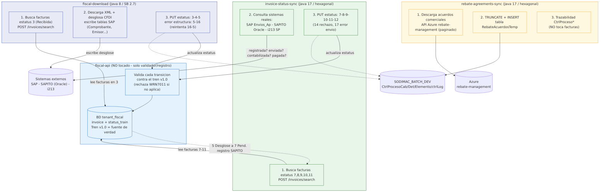

# Diagrama de flujo: 3 batches ↔ fiscal-api

> Vista gráfica del flujo entre los procesos batch y fiscal-api. Fuente editable: [diagrama-batches-fiscal-api.mmd](diagrama-batches-fiscal-api.mmd) (Mermaid). Imagen: [diagrama-batches-fiscal-api.png](diagrama-batches-fiscal-api.png).
> Relacionado: [ANALOGIA_BATCHES_FISCAL_API.md](ANALOGIA_BATCHES_FISCAL_API.md).



## Cómo leerlo

- **fiscal-api = cerebro** (NO se tocó su código): guarda las facturas + el tren v1.0, y **valida** cada cambio de estatus contra `status_train`. Rechaza con `WRN7011` si el salto no aplica. Los batches le piden datos (`POST /invoices/search`) y le mandan cambios (`PUT /invoices/{uuid}/status`).
- **fiscal-download** (recepción): toma facturas en `3 Recibida`, baja el XML, desglosa el CFDI (escribe tablas SAP), avanza `3→4→5`. Error de estructura: `5→16` (reintenta `16→5`).
- **Handoff** `5→7`: tras el desglose, la factura queda pendiente de registro en SAPITO = entrada de invoice-status-sync.
- **invoice-status-sync** (despacho/pago): toma `7,8,9,10,11`, pregunta a SAP/SAPITO(Oracle)/i213 reales, avanza `7→8→9→10→11→12`.
- **rebate-agreements-sync**: aparte — baja convenios de Azure a `RebateAcuerdosTemp`. NO toca facturas.
- **Líneas punteadas a BATCH_DEV**: los tres dejan trazabilidad en `CtrlProcesoCab/Det/Elemento/ctrlLog`.

## Tecnología por batch

| | fiscal-download | invoice-status-sync | rebate-agreements-sync |
|---|---|---|---|
| Java | 8 | 17 | 17 |
| Spring Boot | 2.7.18 | 3.2 | 3.2 |
| Arquitectura | clásica | hexagonal | hexagonal |
| Persistencia | JPA + MapStruct | JdbcTemplate | Spring Data JPA |
| BDs | SQL Server (SAP, BATCH) | SQL Server (SAP/i213/ctrl) + Oracle (SAPITO) | SQL Server (REBATES, BATCH) |
| HTTP cliente | RestTemplate | RestClient | RestTemplate |
| Fuente externa | fiscal-api | fiscal-api + SAP/SAPITO/i213 | API Azure rebate-management |
| Resiliencia | — | Resilience4j | Resilience4j |
| Ejecución | CommandLineRunner (1 shot) | Scheduler + web (trigger) | Scheduler + web (trigger) |

## Regenerar la imagen

```bash
docker run --rm -v "/c/workspace-sodimac/docs/analisis:/data" minlag/mermaid-cli \
  -i /data/diagrama-batches-fiscal-api.mmd -o /data/diagrama-batches-fiscal-api.png -b white -s 2
```
