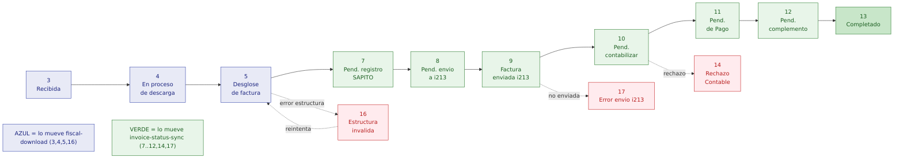
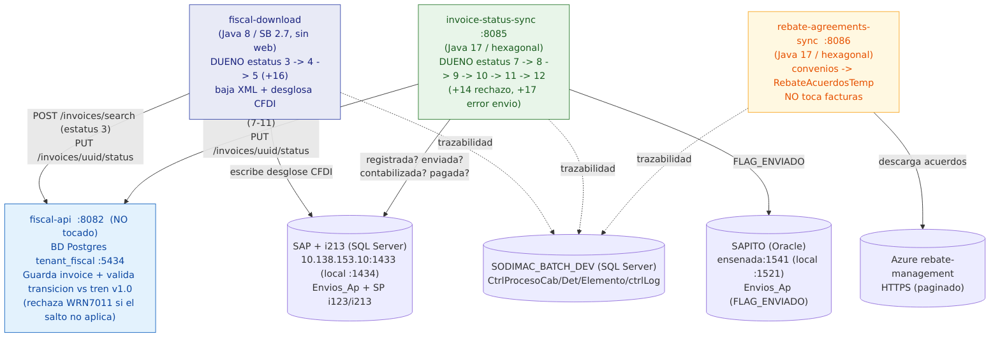
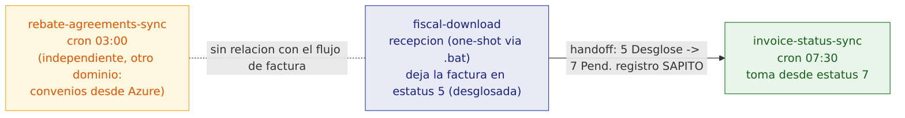

# Diagramas: 3 batches ↔ fiscal-api

> Panorama dividido en 3 diagramas (Mermaid + PNG). Fuentes editables `.mmd` en esta carpeta.
> Relacionado: [ANALOGIA_BATCHES_FISCAL_API.md](ANALOGIA_BATCHES_FISCAL_API.md).

## 1. Tren de Estatus v1.0

Flujo de la factura por estatus. **Azul** = lo mueve fiscal-download (3,4,5,16). **Verde** = lo mueve invoice-status-sync (7..12,14,17).



Fuente: [diagrama-1-tren-estatus.mmd](diagrama-1-tren-estatus.mmd)

| # | Estatus | Dueño | Siguiente |
|---|---|---|---|
| 3 | Recibida | fiscal-download | 4 |
| 4 | En proceso de descarga | fiscal-download | 5 |
| 5 | Desglose de factura | fiscal-download | 7 · (error→16) |
| 16 | Estructura inválida | fiscal-download | 5 (reintenta) |
| 7 | Pendiente registro en SAPITO | invoice-status-sync | 8 |
| 8 | Pendiente de envío a i213 | invoice-status-sync | 9 |
| 9 | Factura enviada a i213 | invoice-status-sync | 10 · (error→17) |
| 17 | Error envío i213 | invoice-status-sync | 8 |
| 10 | Pendiente de contabilizar | invoice-status-sync | 11 · (rechazo→14) |
| 14 | Rechazo Contable | invoice-status-sync | 8 |
| 11 | Pendiente de Pago | invoice-status-sync | 12 |
| 12 | Pendiente de complemento | invoice-status-sync | 13 |
| 13 | Completado | — | terminal |

> Otros del tren (no en el camino batch): 1 Rechazo Comercial, 2 Recibido Parcial, 6 Error desglose (huérfano), 15 No válido fiscal, 18 Pago Manual.

## 2. Arquitectura / flujo

Quién habla con quién, con puertos y hosts. fiscal-api **NO se tocó** (solo valida/registra).



Fuente: [diagrama-2-arquitectura.mmd](diagrama-2-arquitectura.mmd)

| Componente | Puerto / host |
|---|---|
| fiscal-api | :8082 · Postgres tenant_fiscal :5434 |
| invoice-status-sync | :8085 |
| rebate-agreements-sync | :8086 |
| fiscal-download | sin web (CommandLineRunner) |
| SAP + i213 (SQL Server) | 10.138.153.10:1433 (local :1434) |
| SAPITO (Oracle) | ensenada:1541 (local :1521) |
| Azure rebate-management | HTTPS |

## 3. Orden de ejecución



Fuente: [diagrama-3-orden-ejecucion.mmd](diagrama-3-orden-ejecucion.mmd)

1. **rebate-agreements-sync** — cron 03:00 (independiente, dominio aparte).
2. **fiscal-download** — recepción (one-shot vía .bat). Deja la factura en estatus 5.
3. **invoice-status-sync** — cron 07:30. Toma desde 7 (handoff 5→7 = registro SAPITO).

## Tecnología por batch

| | fiscal-download | invoice-status-sync | rebate-agreements-sync |
|---|---|---|---|
| Java | 8 | 17 | 17 |
| Spring Boot | 2.7.18 | 3.2 | 3.2 |
| Arquitectura | clásica | hexagonal | hexagonal |
| Persistencia | JPA + MapStruct | JdbcTemplate | Spring Data JPA |
| BDs | SQL Server (SAP, BATCH) | SQL Server (SAP/i213/ctrl) + Oracle (SAPITO) | SQL Server (REBATES, BATCH) |
| HTTP cliente | RestTemplate | RestClient | RestTemplate |
| Resiliencia | — | Resilience4j | Resilience4j |
| Ejecución | CommandLineRunner (1 shot) | Scheduler + web | Scheduler + web |

## Regenerar las imágenes

```bash
cd docs/analisis
for n in 1-tren-estatus 2-arquitectura 3-orden-ejecucion; do
  docker run --rm -v "/c/workspace-sodimac/docs/analisis:/data" minlag/mermaid-cli \
    -i "/data/diagrama-$n.mmd" -o "/data/diagrama-$n.png" -b white -s 2
done
```
